# A2 – Truss Stress Analysis

## Objective
The purpose of this project is to design and analyze a truss that can handle the given applied loads (including a factor of safety) from the given 2D Truss problem seen below. We were told to either use A500 steel or another suitable material that will be used for truss members. TO solve this, I will be needing to create free body diagrams for the pin joints to determine the forces acting throughout the structure. These forces will then be used to calculate the required cross sectional areas of the truss members and the appropriate pin sizes based on shear forces and safety factors. Both symbolic and numerical calculations will be used throughout the design process. After completing the analysis the total weight of the truss and pins will be estimated and a CAD model will be developed using the calculated dimensions and connections. The weight from the CAD model will be compared to the hand calculations to evaluate the accuracy of the design. Then the results will be reviewed to identify the main engineering concepts and lessons learned from the project. Finally, I will need to figure out how the truss components will likely fail. This last part I will dedicate to its own section for simplicity.
### The given problem
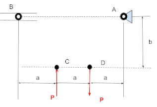

The problem states that we can choose to make the loads (P) at points C and D have a magnitude of 20-40 kN, that distance a = .4m and b = .3m, and that point A is a pin support while point B is a roller support. 
 
Note: After forgetting that the points with P were prenamed, I will from here on out call point C as point D and call point D as point E.
### Safety Factors
We were given a safety factor of 3.5 to solve the minimum cross sectional area of the members. While given a safety factor of 4 for the minimum cross sectional area of the pins.
### Material for the Members
The problem initially asks for A500 Steel to be used, however, this is a problematic steel for this project. As I will show, I decided to switch to A36 steel.
### The pins material properties
The given properties for the pins are that they have a yield shear strength of 170 ksi and a density of 0.278 lb/in^3.

## Analyze
### Statics: Solving the Designed Truss
#### Equations of Static Equalibrium: ΣFx = 0, ΣFy = 0, and ΣM = 0
These are foundational equations for statics problems. These allow the ability to solve for unknown forces and moments acting on a truss with applied loads, assuming that the truss is completely stationary. By using these, I will be able to find the forces acting on each member and pin of my designed truss.
##### Method of Joints
The chosen method to solve for the internal forces of each member will be the method of joints. This method is done by focusing on each pin joints and the internal forces (from the members) acting upon it. Then the static equilibrium equations ΣFx = 0 and ΣFy = 0 are used to solve for each members internal force. However, the starting point must be a joint with enough know applied forces that would allow that specific joint's unknown applied forces.
### Solid Mechanics: Finding the Minimums Cross-Sectional areas
#### Stress
Stress is one of the most foundational parts of physics used for Mechanical Engineering. The two main types of stress are Normal stress σ and Shear stress (τ). They both equal Force divided by area, but the area of the shear stress is multipled based on whether it is single shear, double shear, or more. I will be using normal and shear sted to find minimum cross sectional areas for the pins and members. But in order to do so, I have to relate them to the yield strength of the material and the given safety factor. The yield strength (dependent on the material used) is used since it tells us the normal stress needed in order for the member made of A36 will start to have plastic deformations, which is considered a failure point in a truss' case (sometimes it can be a good thing in certain applications). Then, by dividing it by the safety factor, this allows the truss to be designed to face far harsher forces then it normally would face such as extreme events (like hurricanes or car explosion) or fatigue (cyclical usage over time).

## Decide
### Truss Design
For the design of my truss, I decided to keep it as simple as possible. My biggest deciding factor for the entire project was time. I have a significant amount of homework to do, so I decided to not be creative and stay as simple as possible. With that in mind, I first simply connected the dots of the supports and load locations to make a upside trapezoid. Although I kept things simple, I still wanted the truss to be strong. Triangles are generally the best shape for structure in trusses, so I connected pins D and E to the center of the top member to fill in the center outline with only triangles. This should allow the structure to withstand loads more efficiently. However, I realized that simply connecting D and E to the top member would no longer make it a two-force member. Keeping the theme of simplicity, I decided to split that the top member in half. In real life, many truss designs usually keep that as one whole member, however this would make the math harder and increase the time commitment. Now, I have my finished truss. 

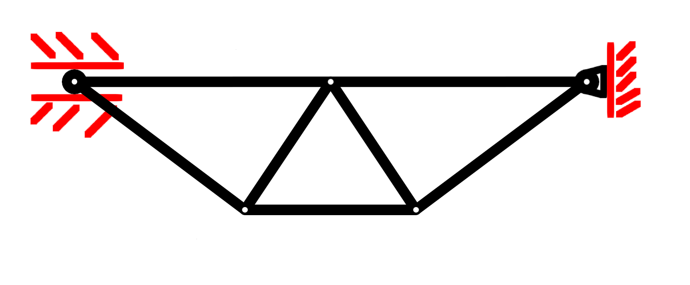
 
Then, for the external loads at D and E, I decided to allow them to have equal magnitudes of force with no reason for using 25 kN other than I like the number. The reason is that it will keep the math simpler in this case (as the math will show). This is because I designed the truss to be symmetrical in shape along with the external forces, and adding that the external forces are equal and only in the y-direction, this limits the reaction forces to one direction. More importantly, this will allow the mirrors of each member to have the same internal forces with only opposite signs. Lastly, unbeknownst to me, this actually allowed the member connected from E to D to have no internal force, further simplifying the math. 
 
### Shape of the Cross-Sectional Area of each Member
While not generally important for the calculations of this specific truss problem(at least for 2156), I decided to make the make the cross sectional area of each member a square. My only reason, at the time of the decision, was that generally squares are better for strength than other simply shaped member cross-sections. However, I soon found this was also an unintentionally wise choice for making the math simpler. This made it simple to find the widths instantly, and therefore I (unlike a rectangle) didn't have to think at all about the orientations of the beams and how to find the lengths of the pins. Even better, I didn't have to do more math and reasoning on how exactly I needed to calculate the Moment of Inertia when trying to figure out the critical buckling load of certain members.
 
### Change in material choice
Immediately after seeing that A500 steel was the expected choice of material for this lab, I went and checked Solidworks and Creo to see if they had the material in it selections. Sadly, they did not. Then, while trying to find the material properties of A500 steel online, I discovered that this specific steel is solely used for tubing and that it has different grades (and therefore properties) for the material ("A500 Steel"). The thought of this did not sit well with me. For one, I didn't want to think about which grade to choose and  how to deal with their difference in properties that I might need later in the project with CAD. Especially considering that they had other premade steel selections to chose from. Also, I found it would be rather silly to use this sort of material for a task that its just not really designed for. So for the sake of simplicity and ease of mind, I decided to just chose a material found in Solidworks. For my choice of material, I did not want to have research each steel that Solidworks offered to figure out which was the most reasonable. So to speed up a choice that I honestly didn't even have to change in the first place, I just screenshotted the list and asked ChatGPT "Of these list of different steels. See which one is best used as a solid, nonhollow steel for the elements of a truss." While lazy, I immediately found out that of the list, A36 is specifically a structural steel and one of the most commonly used for trusses, then I fact checked this ("What Type of Steel"). Spending to much time on this, I just decided to go with it
 
### Design of Shear Connection
To start, the shear connection was simplified to focusing on the pins. For that reason, I took the connection part of "Shear Connection" literally. As in, I designed a pin that would allow the members to stay attached to it. While looking through Gooogle images to brain storm ideas on how I can keep the members from falling off the pin, I decided on combining a Clevis pin with pin locks. Clevis pins seemed like the obvious choice to me because it has one side that blocks the members movement, then allows me to add each member one by one, and finally I can lock them in place by easily attaching, and reattaching a separate pin to the opposite side of the pin. Usually, cotter pins are used as the secondary pin, but I though that it could possibly be too weak for a truss facing 10s of kN of force. So I decided to use a sort of pin lock to keep a regular cylinder pin in place which could take on stronger forces. However, as seen in drawing and 3D model, I made a poor choice of putting the screw mechanism into the line of motion that the members will move it. This is a more risky choice then putting it perpendicular on the side of the main pin. I only realized this as I was typing this, so I can not go back and change it. Lastly, I decided to change the clevis pin to have a flat side instead of circular looking pin at the last minute. This could allow any forces to spread out across the surface instead of just focusing it on one point at the edge of the original circular design. This change is seen in the 3D model. I did not do the same thing for the secondary pin due to a lack of time.
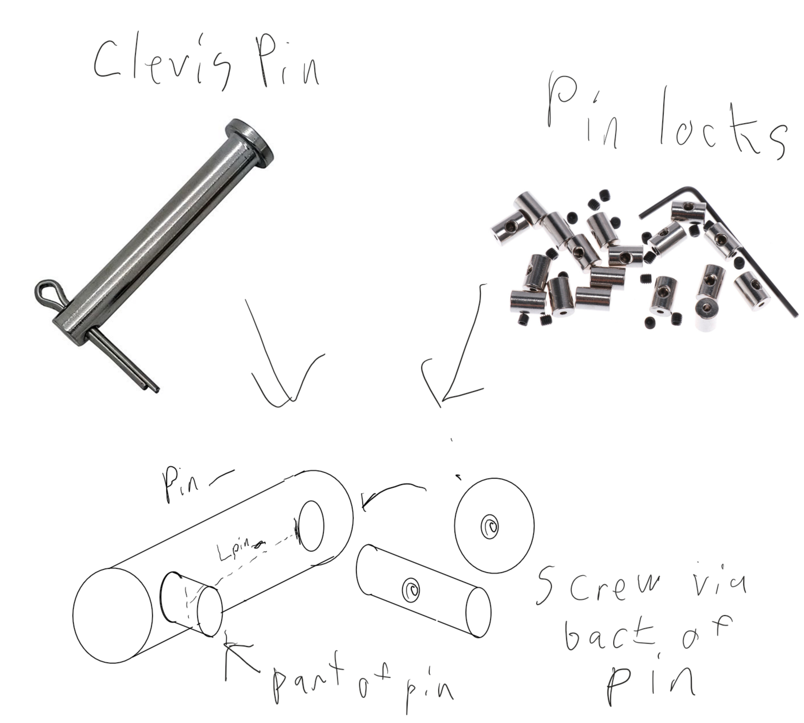
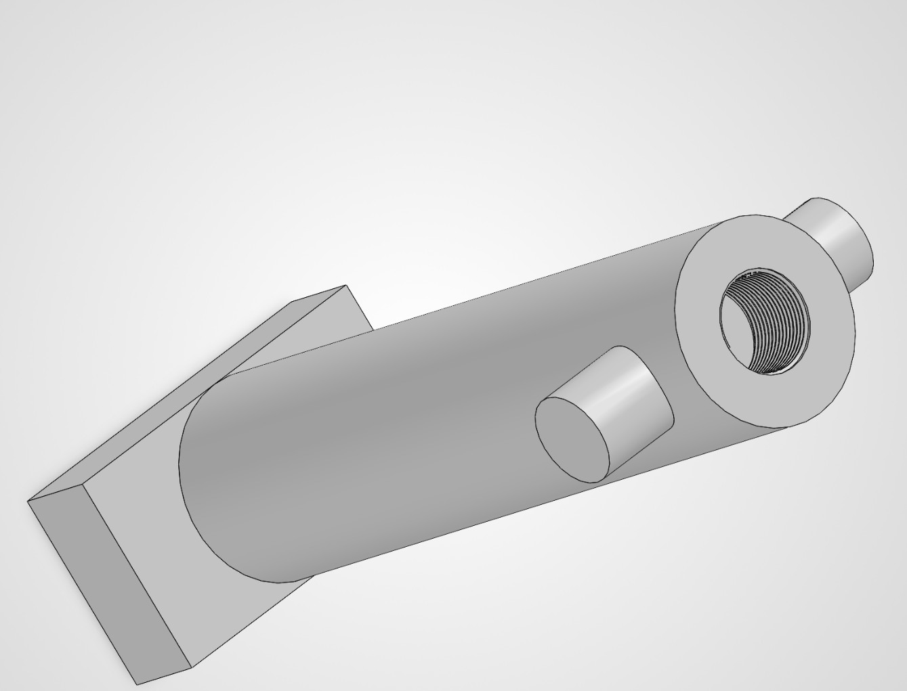

### Single Shear, Double Shear, or More
Later, I will need to decide what sort of shears I will be facing at each pin. The problems is that I do not know how to identify them in a weird cases, so I will try with my best judgement. To start, I decided to treat the A and B pins at the supports as single shear, because there are only two members at each support and external forces are not normally treated as part of shearing. Then, when it came to pins D and E, although they technically have 3 members, member 4 actually is applying no forces to those pins. Since I wasn't told this truss will face any other scenarios, I think it would be important to treat it as a single shear. Even then, if the force somehow changes and that member is now applying the force, that pin would be extra safe. That is because a double shear lowers the shear stress on a pin. This choice actually led me to find the minimum cross area of the pin. Lastly, I will be treating the pin as C being in a triple shear due to it facing four members at once. I am absolutely sure this last one is not correct, but because of time, I continued with this logic.

## Communicate
### Reaction Forces
The first thing I did with this assignment, even before designing my truss, was to figure out the reaction forces from the supports. After redrawing the given problem and assigning a magnitude of 25 kN forces to both P, I used ΣM = 0 at pin A to find the reaction force at point B. Since because it is a roller and, by definition, will only have one reaction force. Next, I focused on ΣFx = 0, and since the only possible force in the x direction was Ax, that meant that Ax has to be zero. Lastly, now that I have Ay as my only unknown force in the y-direction, I used ΣFy = 0 to solve for Ay.
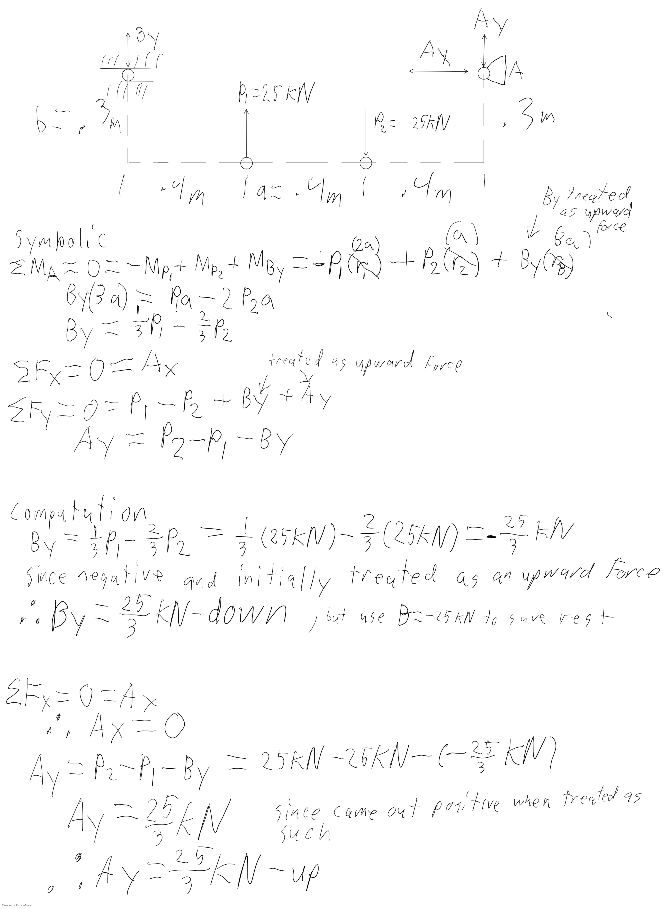

### Lengths and Angles of members
After figuring out my design of the truss, I decided it was best to start by finding the lengths and angles of the members in the truss. Below is a labeled picture of the truss. Notice how I have given each member a number and each pin a letter, for the rest of this project I will name them based off this reference picture.
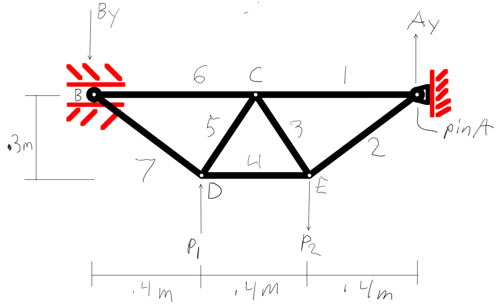
To start, since the truss is symmetrical, only the lengths of members 1 through 4 need to be found. The easiest lengths to find are members 1 and 4. We are told that A to P1 to to P2 to B are .4m away from each other in the x direction. So member 4 is just .4m long, and member 1 is half the distance from A to B (.4*3)m which is simply .6m. Next, to find the length of member 2, I need to simply use lengths "a" and "b" to create a right triangle and use the Pythagorean theorem for the .5m length. Lastly, since the center truss triangle is symmetrical down its center, I just need to split the triangle in half. Because this new right triangle has a base half of "a" and a height of "b", I can use the Pythagorean theorem to find the length of member 3 to be about .361m.
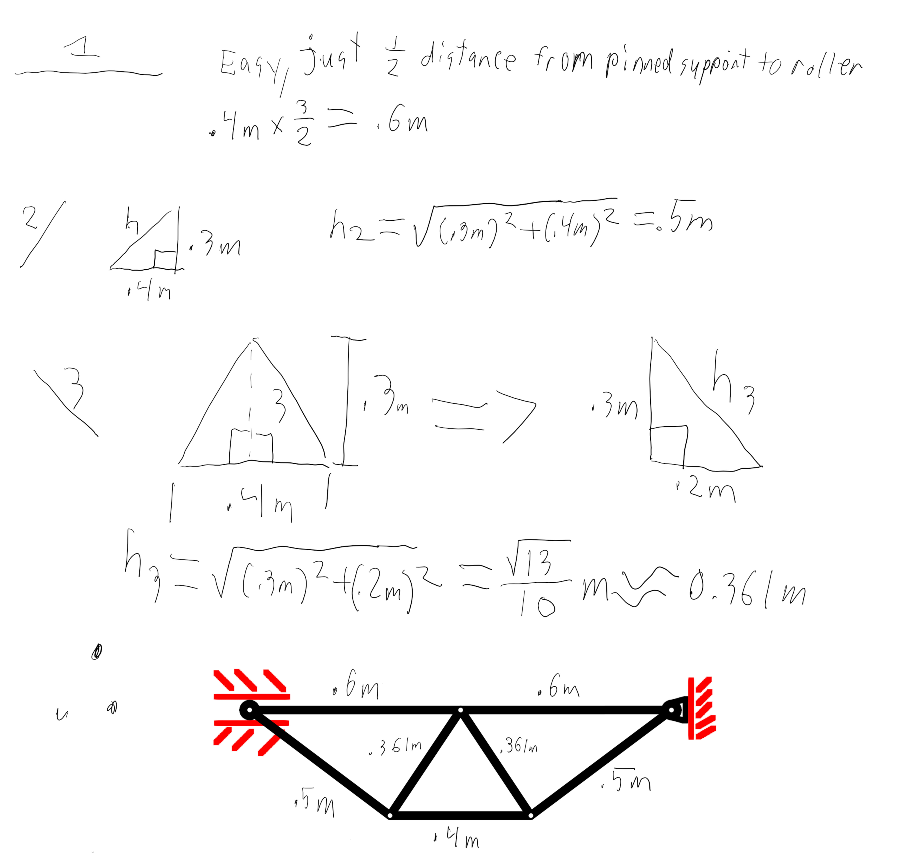
While not exactly angles, I then reused the triangles I made to find lengths by turning them into simpler triangles I could use to replace cos(x) and sin(x) calculations when solving using the method of joints (which I will call my "triangle guides"). Also, after solving all member lengths, I had enough info to just plug in the lengths of the triangle I did not use
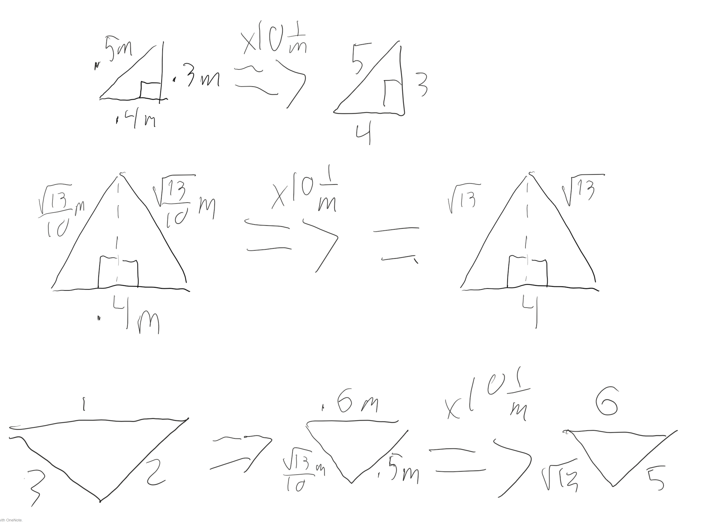

### Method of Joints
Now that I have my reaction forces and angles, I am now able to use the method of joints. I have already put way to much time into this project and overexplained a lot already, so I will only explain my work for pin A.. Keep in mind that when I speak of quadrants, I treat the current pin as the origin of the graph and treat the quadrant I name as where the force arrows is located. However, I treat the quadrant that the vector's direction actually points to on how to decide the (±x, ±y) like an actual vector. Lastly, due to equal and opposite reactions, if the arrow points away from the pin that means the member itself is in tension and then visa versa. Here is a visual guide if my explanation is confusing
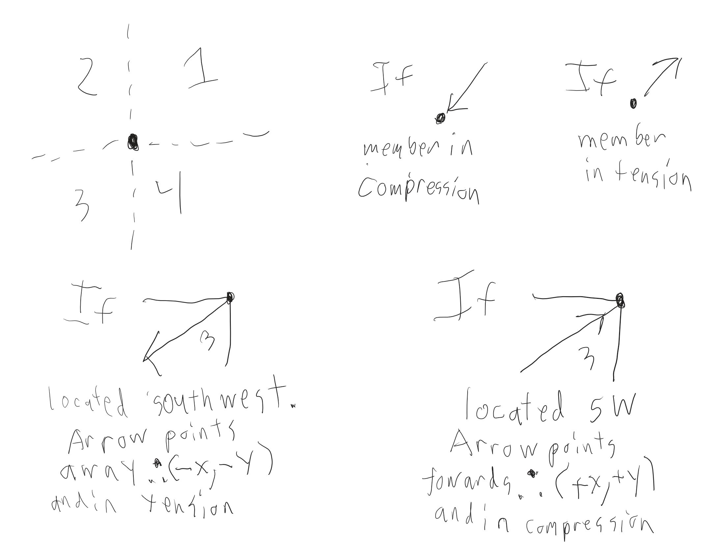
#### Pin A: FBD and Solution
To start, I chose to start at Pin A since it has one known force and only two unknown forces making it rather simple math. In this first method of joints, I was not rather efficient because I did more work then necessary, but I quickly adapted afterwards. At the beginning, I knew that only Ay and F_AE had a y-component, that Ay was in the positive y-direction on the border of quadrant 1 and 2, and that F_AE was in quadrant 3. Based on this info and the process of elimination, the force arrow for F_AE must point away from the pin in order to have equal and opposite y-force to fight Ay. Since F_AE is in quadrant 3 and points away from the pin, F_AE has (-x, -y) components and that member two is in tension. To find F_AE I went backwards for this specific pin: first I used my triangle guide to quickly change F_AEy into F_AE(adj/hypo) and F_AEx into F_AE(op/hypo), then used ΣFy = 0 to put Ay and F_AE in the same equation. Next, since they are equal and opposite, I equated F_AE = Ay(hypo/adj) and solved for F_AE. Moving on to finding F_AC, since I know from earlier that  F_AEx must be facing in the -x direction, F_AC must be positive in order for ΣFx = 0 to be satisfied. After equating ΣFx = 0 to the sum of the x components. Flipping F_AEx to the 0 side of the equation, I then applied F_AEx=F_AE(op/hypo), took F_AE = Ay(hypo/adj) from earlier, and found that F_AC=F_AEx=Ay(opp/adj). This was the long winded way to solve this pin, but as my work shows, I became more effiencet
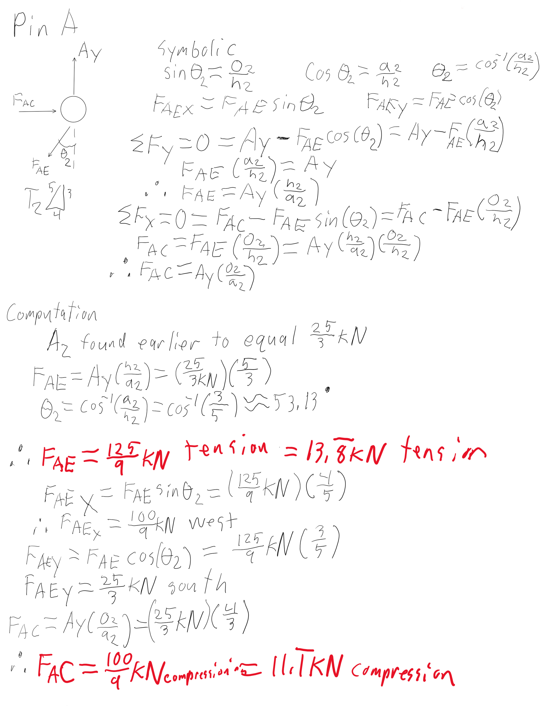
#### Rest of the Pins: FBD and Solutions

#### End result
From my calculations, I found that F_EC and F_CD have the highest magnitude internal force. These will be used to find the minimal cross sectional area for the members

### Using Stress to find the Minimum Cross Sectional Area of the Members
Now I have the highest magnitude of force that the truss faces, I got the yield strength for A36 steel from solidworks, and I was given the factor of safety at the start of the assignment. I can use the normal stress equation to find the cross sectional area of my beams. To start, I take the σ (stress) from the σ=F/A stress equation, and equated σ to the yield strength of the material divided by the safety factor. Next, I rearranged the equation (as shown in my work) in order to find that the minimum cross sectional area to be about 280.4 mm^2.
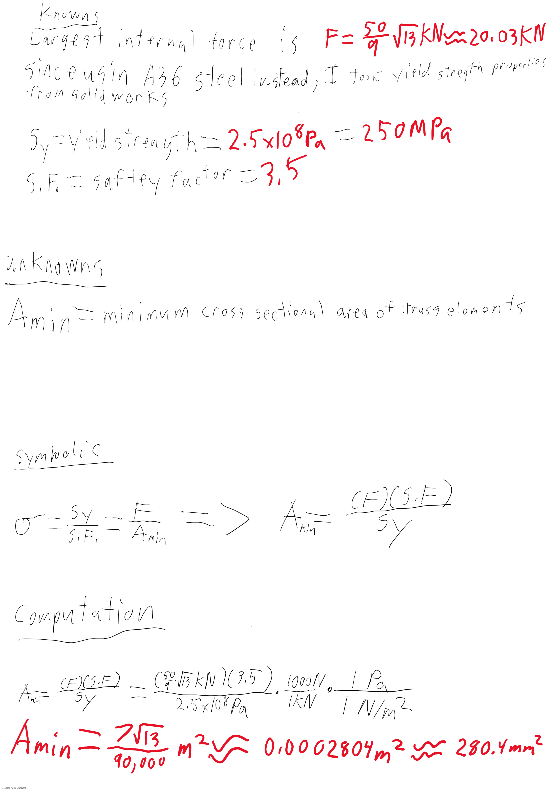

### Weight of the Members
After solving for my cross sectional area for the members, I am able to solve for the truss' weight. Since density is simply mass divided by volume, and I was given the density of A36 Steel from solidworks. All I needed to do was solve for volume. To start, I manipulate the density equation to find that mass equals density times volume. Then I took the previous lengths I found earlier and added them up, following it up by multiplying them by the the found cross sectional area to get volume, and lastly multiplying it by the density. This gave me as mass of 7.311 kg.

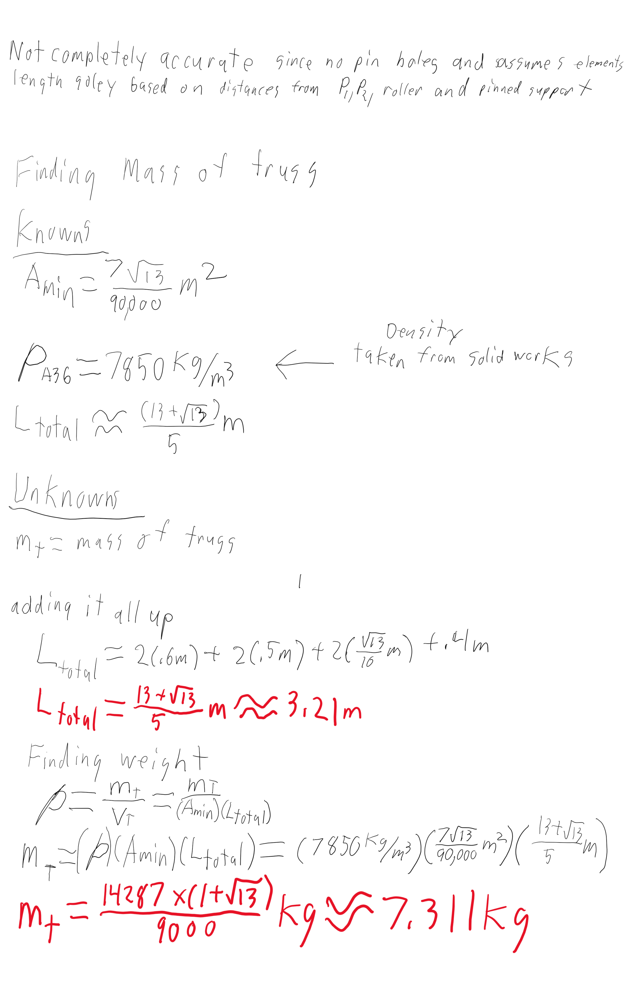

### Using Shear Stress to find the Minimum Cross Sectional Area of the Pins
Essentially, the main equation we used was the same as the one used for finding the cross sectional area as the members with some changes. For one, this will be used to solve for shear, and the give shear yield strength was in ksi, so I converted it to SI units. Second, the area will be replaced with the area for a circle since free pins need to have one to allow free rotations of the members, and this radius will be used for CAD. Lastly, the force needs to be divided "n" which denotes whether it is a single, double or triple shear. To simplify solving for the pins area, we were told to use the resultant vector force from the either the total sum of the positive (or negative) forces in the x direction and the sum of the positive (or negative) forces in the y direction. Once that is done, use the rearranged equation from the member's area section with the additional changes I had just mentioned. The problem was that I was running out of time at this point, so I decided to set up this process in an Excel sheet so that I did not have to do the math for every single pin. I simply have to input the forces and the number of members and it gives me the respective area and radius. The excel sheet will be attached to this webpage. However, as an example, I showed the work to solve for pin D's area because it had the highest required area. This is shown below. In the end, I found that the minimum area was 93.36 mm^2

### Weight of the pins
To find the weight of the pins, I just had to do it the same way I had done it with the members with just two extra steps. Additionally, I sped up this process by again using Excel to calculate each pin and add up the total weight, but I did pin C as an example. This time for the length, I decided to just take the width of each member, add up the number of members the pin will have attached to it, and multiple those two together to get each length of each pin. However, I decided to include the supports at A and B as an additional member since they would also need to be attached to the pin. The example I will use is pin C. Before I took any steps further, counted the number members at C and then I convert the given density for the pins to SI units. Then to find the weight of this pin, I simply multiplied the minimum cross sectional area, the density, the number of members, and the width of a single member to find the weight of Pin C to be 0.04812 kg. Once I found all the pins weights in excel, I made it add them all up together and I found the total pin weight to be 0.1684kg.
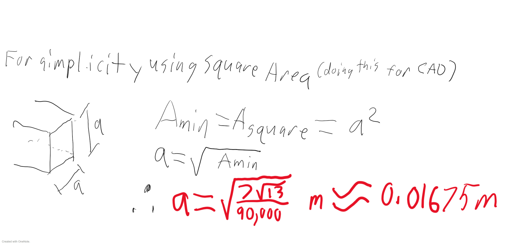

### Creating the Shear Connection Pin in Solidworks
To start, I first created a simple circle with the radius needed to create the minimum cross sectional area of the pin. The length will be changed later
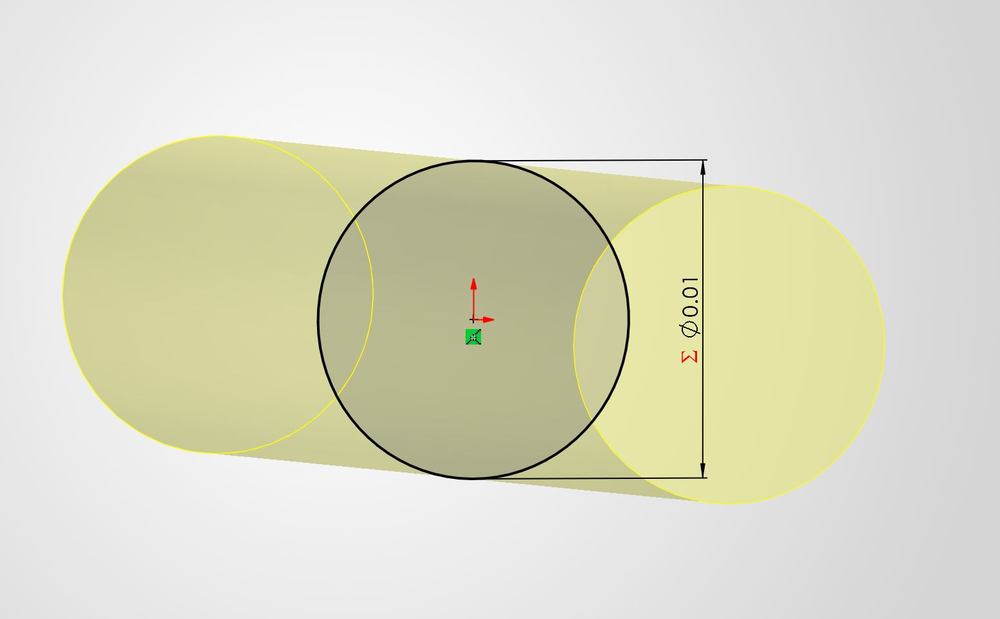
Then I created the screw-in secondary pin. Instead of creating a seperate part and build an assembly, I just treated it as one part. For simplicity, I decided to make the this pins diameter nearly half of the primary's, and made the distance between its center to the primary's edge be the same as well. Then I extruded the pin to be about double the diameter of the primary pin.
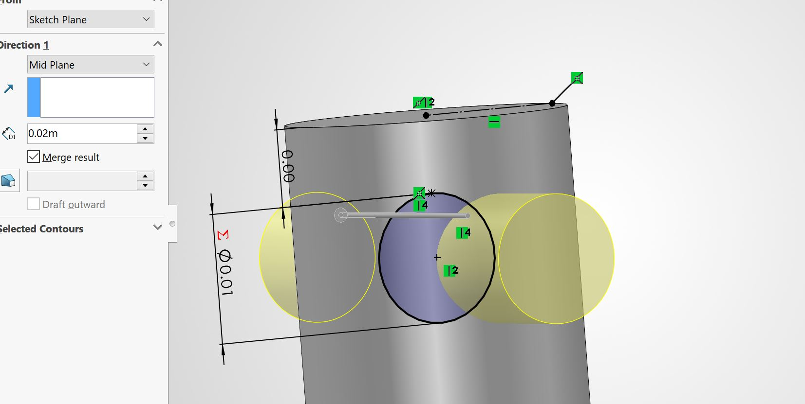
Next, I moved to the bottom of the shaft. I just created a rectangle that had the width of the primary pin's diameter with the same length as the diameter of the secondary pin as well as its thickness.
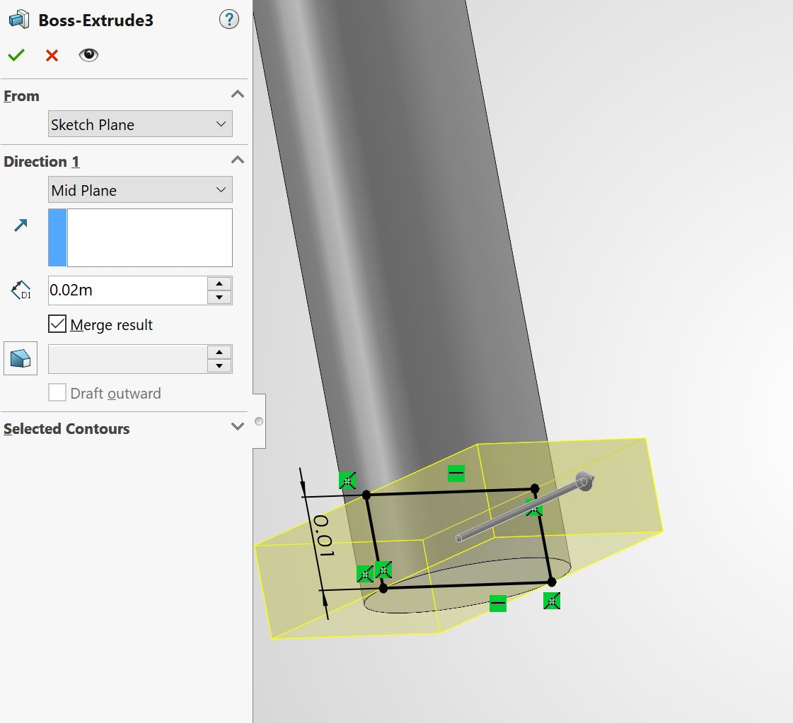
Then I tapped the screw hole into both pins by making a cut excrusion through both holes. Due to a lack of knowledge on how to make a good screw hole for this situation (and as stated already in the wrong position) I just decided on half the diameter of the secondary pin and then cut down to halfway through the secondary pin.
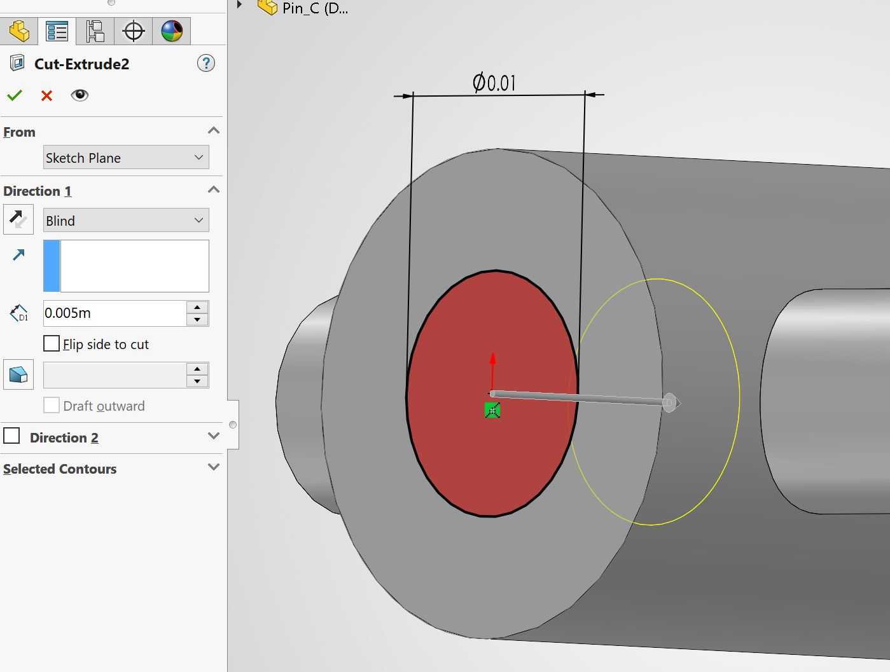
Lastly, I used the thread tool create a thread in the hole with the default thread type.
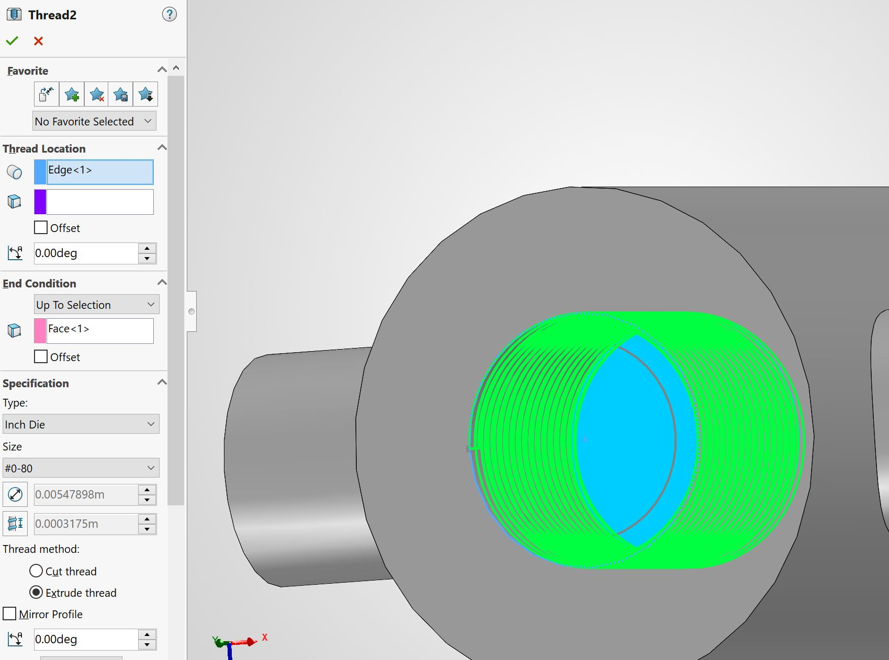
However, I decided to tinker with the equations tools in solidworks to calculate the length of the overall pin that creates the exact amount of space needed between the secondary pin and the rectangular bottom of the shaft that would allow the members to be kept in place. To do so, I took the length equation I used before (number of members times width of a member) and added on the extra bits of lengths from the additional components I added and set that as the overall length of the pin. The example below is pin C and you can compare it to the excel sheet.
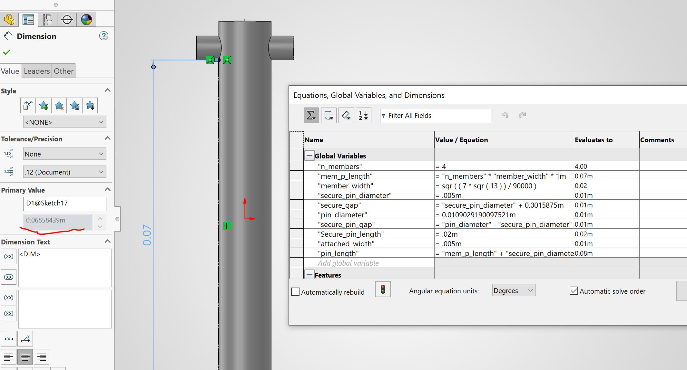

### Truss in Solid Works
This part was relatively simple. For the sketch I used, I simply recreated the outline of the truss design in solid works using the  given "a" and 'b" lengths. Then I simply connected where pins D and E are located to halfway of the top beam. This time giving the width of the beams and adding the pinholes the size of the pins diameter. Then I created additional circles sourrounding the pin holes to allow the members to maintain the cross-sectional area of each element at the intersection of the pin joint. To do so, I simply added together the pins diameter and the memebers width to get the new circles diameter. 
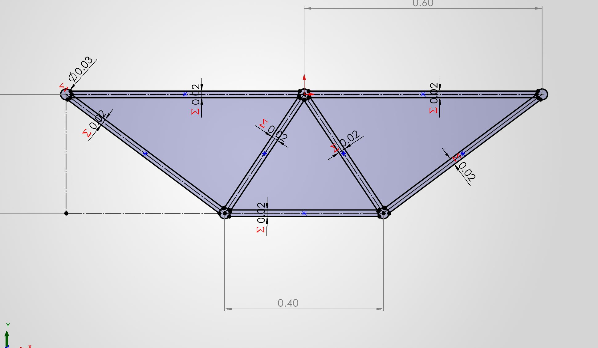
To finish the members portion of the truss, I simply extruded it to width of the members.
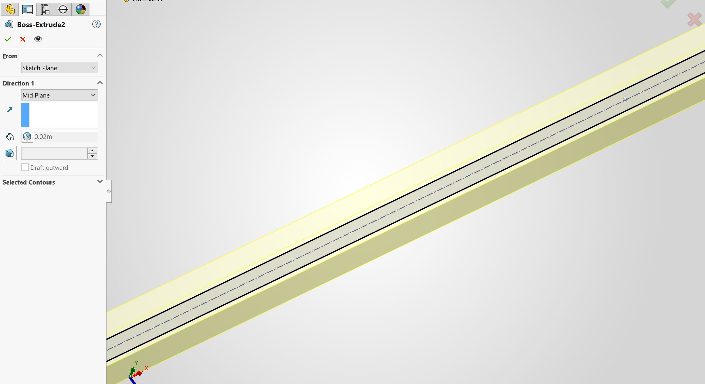
Next, I created and assembly of the truss and pins. Making sure to place each pin model I created into the right place, which was not hard since only one pin was different from the rest. I was able to do so by using the mate tool to align each pins circular surface area with the pin holes surface area located the members intersections. Then I centered each one of them only their central planes. 
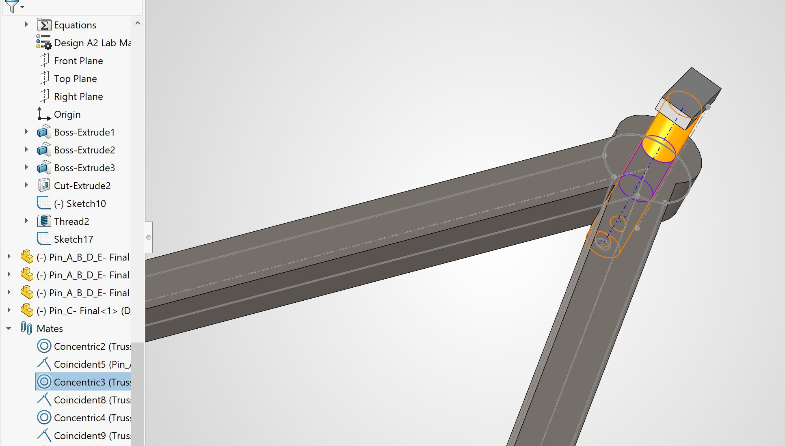
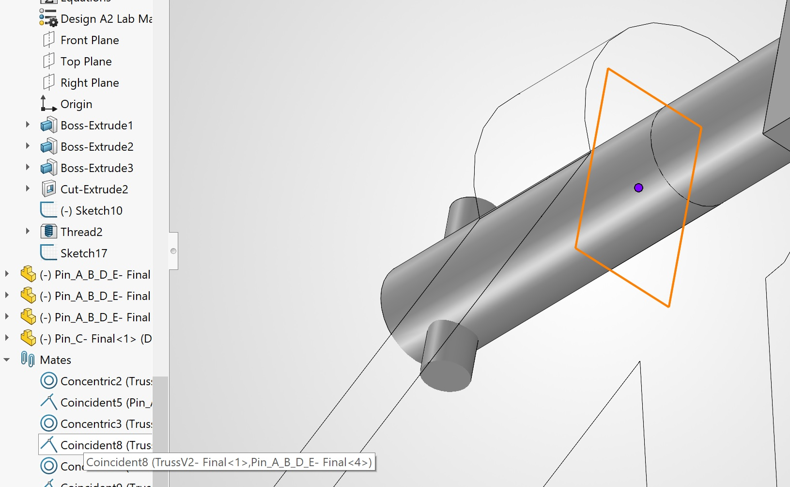
Lastly, I went to the material properties section of the assembly, bumped up the accuracy and decimal points to a lower decimal place, and calculated the actual weight of the assembly. It was found to be 7.550kg. To find the difference is simple by just subtracting the calculated weight by the actual: 7.550kg - 0.1684kg - 7.311kg = 0.0706 kilograms. This is not bad considering that I changed the pin design and the ends of the members.
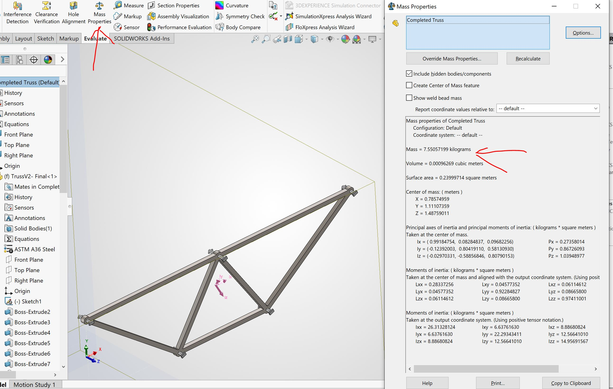

## Likelihood of Failure Modes in Truss Components
### Members
I came to the conclusion that members 1 and 5 will buckle first, and the rest will yield first.

As learned in Manufacturing Systems, steel will yield far before fracturing, so I feel it is safe to assume this will follow suit. With buckling, well I actually forgot how that equation worked since I was briefly taught in my statics class and it never showed up on tests, I was required to at least to look that up. After a quick refresher, I found this would be simpler that I thought. For one, any members that are in tension can ignore buckling since it requires compression, therefore they will yield before buckling. For those that are in compression, it depends on the lengths of each member. Since there were only three members in compression, I decided to just solve it with math. For my truss, all members are pin to pin, therefore K = 1. Then for my moment of inertia, I was able to easily solve since the equation is simply a^4/12. Lastly, I took the elastic modulus from Solidworks. I then also calculated the force that would be required to yield given my chosen cross sectional area. My results showed that it takes less compressive forces on members 1 and 5 to buckle then for yielding to occur. One way to decrease the chance of buckling is to add more webs to the truss and splitting up the chords more. This will decrease the lengths of the members further which lowers 1/L^2 in the buckle equation which is proportional to an increase in the critical buckle load. To decrease the chances of yielding for the rest of the members, the simple answer is to increase the cross sectional area of each member, as shown through out our work in this project.

### Pins
Since pins are such a short length, they absolutely will not buckle due to 1/L^2 from the buckling equations I used earlier. Also, the material we used for the pins are made of hardened steel. As I stated before they will almost always yield before it will fracture due to steels stress-strain graph (although it could in extremely rare situations). To show this, I searched for the material using the given info the professor gave to us, and I found that the material is D2 Tool Steel ("D2 Tool Steel"). From there, I found a stress-strain graph (Algarni), as seen below, that shows that it takes a significant amount more force to fracture than for it to yield Therefore, the most likely failure will be yielding. While trying to figure out a way to add more resistance to yielding while keeping the same material, I could not find any other reasons than when I had done for this project. The only thing that can be done is to further increase the cross sectional area of the pins.
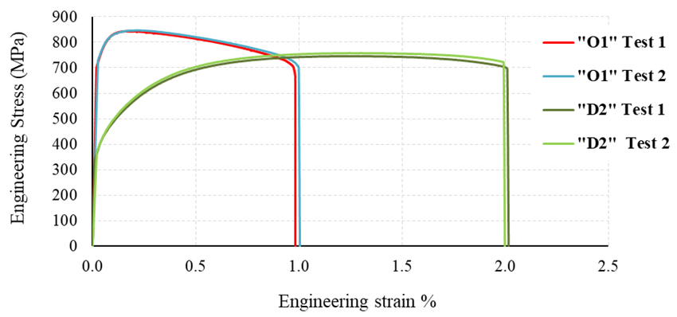

## What I learned
In this project, I learned to use my acquired skills in Statics and Solid Mechanics to design a truss that can handle given applied forces. By using the material properties, like yield strength, of the material I decided to use for this truss, I was able to calculate the dimensions of the members and pins that would be needed in order for the truss to withstand the applied forces at safe clearance set by the factor of safety. Then, I was able to take all these into consideration to create my final truss in CAD. Lastly, I learned to figure out how the members and pins of the truss will likely fail and articulate the reason why.

## Time 

This project took far longer than I anticipated. I am greatly ashamed to say that this took me 25 hours to complete. While the additional 2157 section did not help, this was solely on me. Clearly I need to stop being perfectionist or this semester will collapse on me

## Downloads
I could not figure out how to add the file to github and then create a link to download it. Therefore, I sorta made a link by adding it to google drive
[Download the Assembly file](docs/assignments/A02/Downloadables/Completed Truss.zip)

## Sources
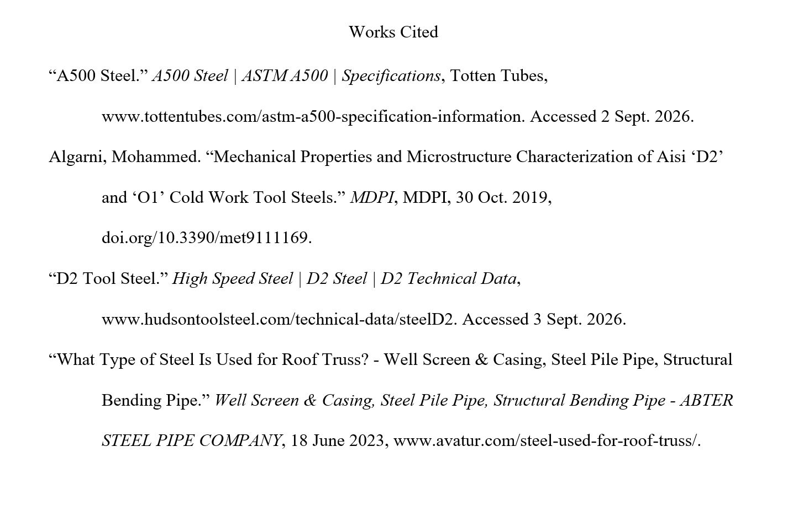
