# A3 - Parametric and FEA
## Objective
The class is required to use axial deflection modeling and parametric design to determine the appropriate dimensions and length of a bar by parametrically designing it within CAD. The project also introduces Finite Element Analysis (FEA) and allows us to compare different analysis methods to evaluate and improve the design. I will be using SolidWorks with its Simulation addon to use as an FEA since I learned to use it in a previous class. We are told to choose the dimensions of the cross sectional area and choose the material's young modulus and axially applied load within given ranges. We are also given a max axial deflection of .009 inches (in). 

## Parametric Design
### Choosing and Setting Up the Parametric Calculations 
To start, I wrote down the general idea of how this project will go as shown below (I made additional changes later). 
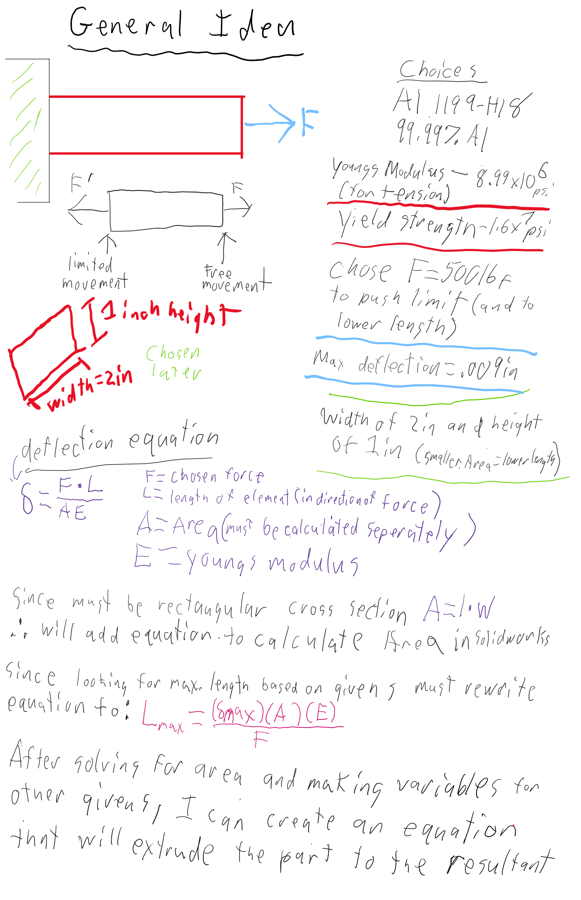
Having gone through the EPA homework for this week, I got a clear reminder of how each component affects the deflection equation, and so it easily transferred to how everything will affect each other after rewriting the equation to calculate the max length given chosen parameters. Given the material is metal and we are told .009 in of deflection, the length is going to be very long. For that reason, I decided that the main goal of my choices was to try to minimize the lengths size as much as I could. Although I didn't base my decision for this on my choice of material, surprisingly it lead to nearly the minimum young's modulus.

#### Choice of Area
For this part, I was unsure if I was supposed to have a circular or rectangular cross section for the bar since the assignment sheet says circular under the "Description" section. While the rest of the document implied rectangular and the lecture slides used rectangular as well. Based on that and since the questions asked in the document implied rectangular, I decided to stick with rectangular. For that reason, I knew that the equation for the cross sectional area was simply height times width. Also, knowing that area is proportional to the length of the rod, I decided to use a height of 2 in and width of 1 in. I could have gotten smaller or used a simple square, but I wanted easier numbers to work with without making the shape too simple.

#### Choice of Force
Still sticking to the goal of minimizing the length, I decide to max out the force at 500 lbf. As opposed to area, force is inversely proportional to area. Therefore, as force increases, the length decreases.

#### Choice of Material
For my material, I decided to make a material in SolidWorks that is as close to pure aluminums as I could find. Using [this article](https://tkcopperandbrass.com/2022/04/07/a-guide-to-the-aluminum-alloy-numbering-system/) to find the name of an aluminum alloy that might get me high purity. I found that the aluminum to look for was Al 1199, where the 11xx stands for 99.xx% purity and the 99 means that the alloy is 99.99% aluminum. After seeing some additive letters such as "1199-H18" and "1199-O", I decided to just ask ChatGPT "What does the H18 stand for in '1199-H18.'" It told me that for this alloy, H18 means it was fully strain hardened, and as I learned from Manufacturing systems, this strain hardening should increase its strength. Since strength will be useful later, I decided to find a Data Sheet for the 1199-H18 Aluminum which lead me to [this MatWeb data sheet](https://www.matweb.com/search/datasheet.aspx?MatGUID=7a321b89269943629bb6d7a0a4a357b2). After looking through the material properties, I was surprised to find that its tensile and shear modulus were completely different, and both were much lower (1000+ ksi less for tension and 1000s ksi less for compression) than the young's modulus that I found for other aluminum alloys near 99% in solid works and [this aluminum manual I found online](https://www.academia.edu/39950576/Aluminium_Design_Manual_). Wondering if this could have been and issue with this site, I looked for another data sheet and [found it was the same in the ASM handbook for aluminum](https://dl.asminternational.org/handbooks/edited-volume/91/chapter/2090685/1xxx-Aluminum-Alloy-Datasheets)! To double check to make sure that even .40% purity difference could cause a drastic change, I decided to ask my manufacturing systems professor since he is a material engineer. To my surprise, he he seemed to confirm that it was possible. I would love to understand why this is the case when compared to even 99.50% purity difference, but due to a lack of time I decided to just stick with it. Also, luckily there will not be shearing for this project, because it has an shearing modulus of 3.63× 10⁶ psi while having a tensile modulus of 8.99 × 10⁶ psi. So therefore I technically fit within the young's modulus requirement. I also found it had a yield strength of 1.6 × 10^7 psi and a tensile strength of 1.67 × 10^7. Unfortunately, I later realized that a pre-chosen yield strength would be given to us, since I read the example paper for A3 and assumed we were to choose our our own material. So I came to the realization that I wasted all this time on research for a decision that should of taken 5 seconds.

### Creating the Bar
#### Entering the Material Properties into SolidWorks
After opening SolidWorks, I decided to just immediately create the 1199-H18 and insert the material properties. To do so I simply went to the property manager on the left side of the bar. In a series of right clicks, I right clicked Materials in the property manager and selected edit materials; then I scrolled down and right clicked custom materials and selected Create New category and named it aluminum; and finally I right clicked aluminum and selected New Material. Once finished, I changed the settings to Linear Elastic Isotropic and IPS units. Then I entered the alloy of Aluminum I am using and all its material properties I could find. 
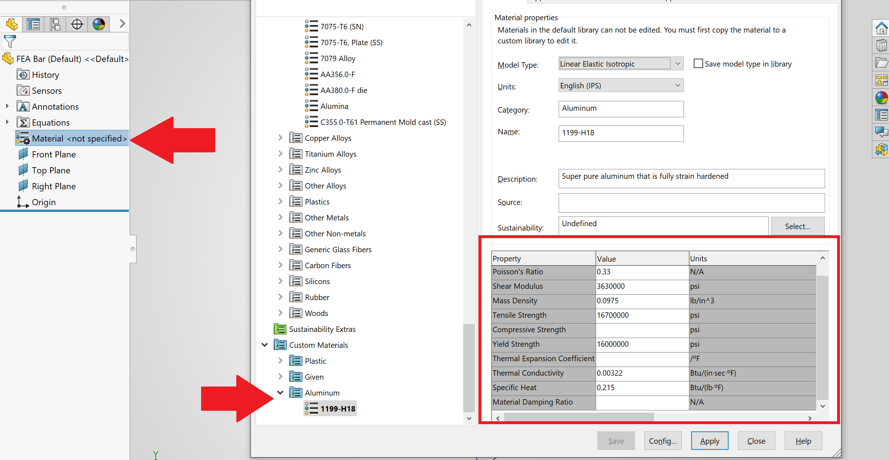

#### Setting Up the Parametric Equations
Next, I implemented all the known Data that I had and the equations I had written down. To do so, I simply right clicked Equations under the property manger and selected Manage Equations. Under global variables, I added my choices, givens, and equations in order of use. All you need to do is click the further left box in the global variables section to name the variable, and then hit the Tab button to add numbers, arithmetic operators or other variables to the next right side box. Also, when adding variables to an equation, you can click other variables to instantly add them. Units are not really necessary in this case, but I labeled them when I could.

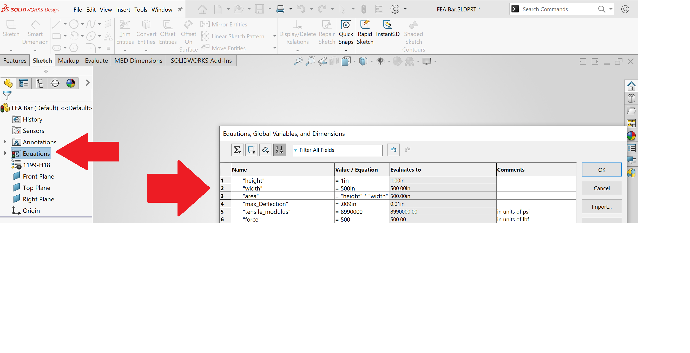

#### Creating the Bars Sketch
I moved on to creating the sketch. Instead of manually calculating the extremely difficult area equation, I simply made area = height * width. Then I changed them to my chosen dimensions. This calculated an cross sectionally area of 2, I would have never guessed. 
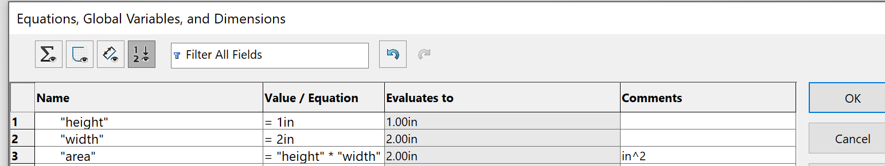
After that, I created a sketch of a rectangle. All you have to do to make a dimension a variable is edit the dimension, type = and finally start typing the name of the variable and hit enter once it pops up. As show in the gif, this instantly changes the dimesnion into the variable.
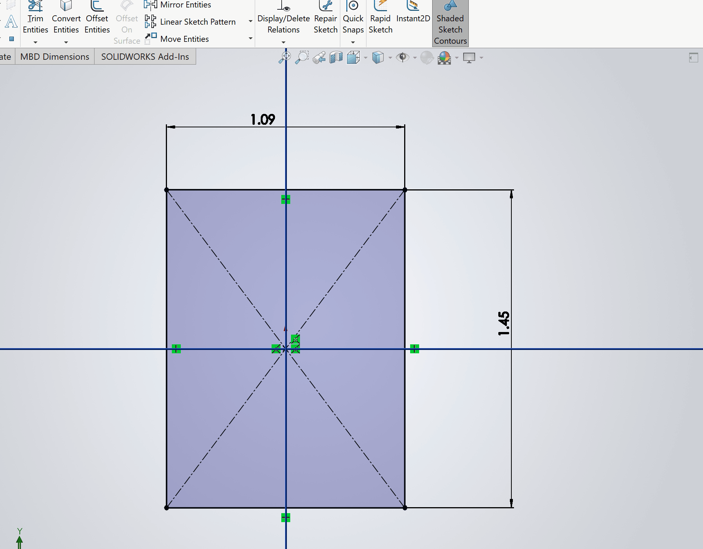
#### Giving the Bar its Length
Once finished, I went back to the equation manager and entered the manipulated deflection equation to solve for the required length of the bar to meet the required deflection. 
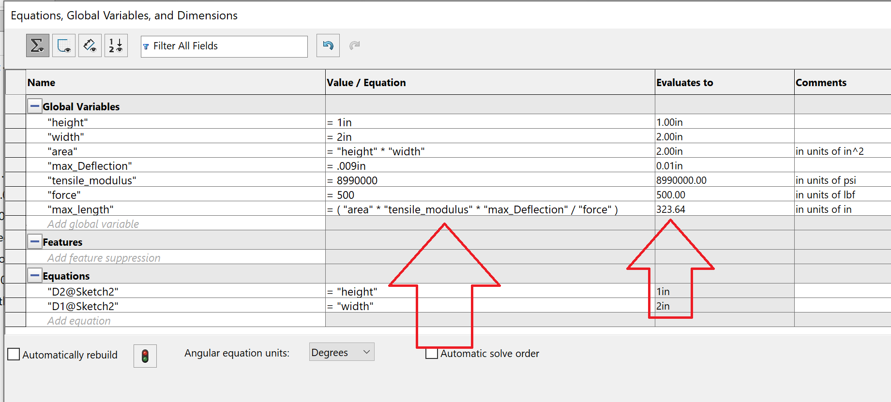
Without looking at the result, I then extruded the bar by adding the "max_length" equation variable to the extrude distance. To my surprise, I scrolled out and saw this:
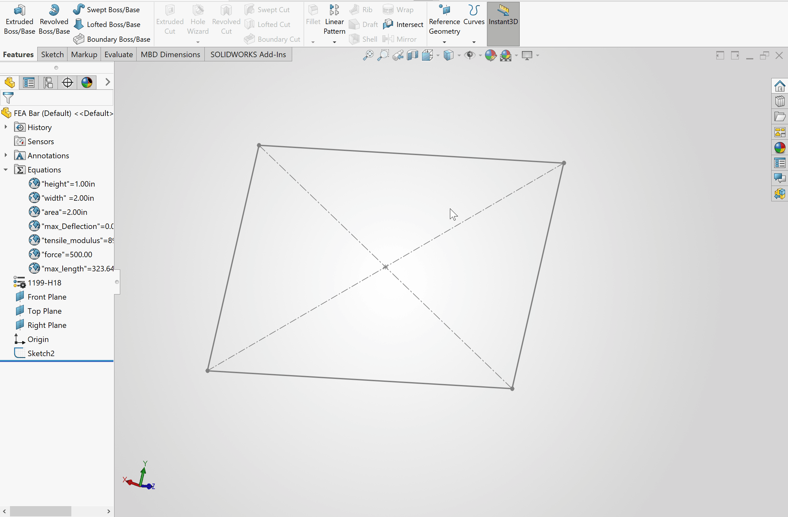
Well, it was definitely a lot bigger then I expected and I already expected it to be very long. This is simply because the force is just way too low for a metal. No matter what I do to the area, it will simply look comically longer then its other lengths. In the end, the length of the bar needed to have a .009 in deflection given my chosen data is 323.64 inches.

## Finite Element Analysis
### Setting Up the FEA
Due to the lack of time, I will be giving a general explanation of each step and I will be substituting the detailed explanation gifs that show clearly each step I had committed. 
#### Starting SolidWorks Simulation
Last semester I was taught how to use SolidWorks Simulation, so I already had access to the program and had all the knowledge I needed to breeze through this section. Simply all I did was go in the SolidWorks add on tab, slick on simulation, and created a new study in the newly added simulation tab
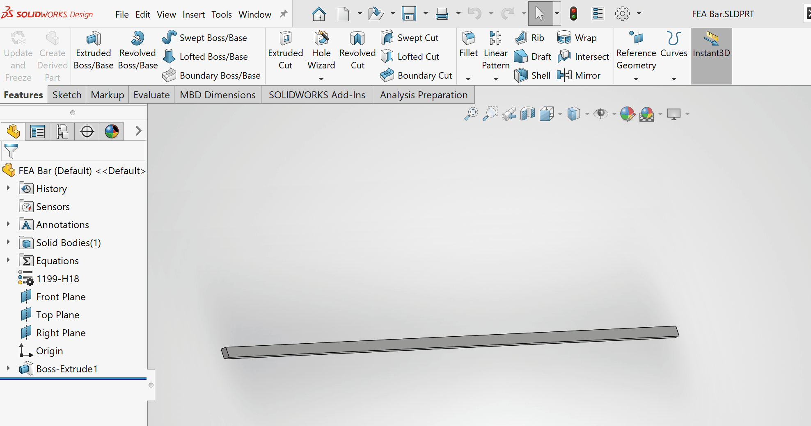
#### Adding a Fixed Support
Next, I added a fixed geometry fixture to one of my cross sectional areas. This essentially acts as a fixed support for the beam.
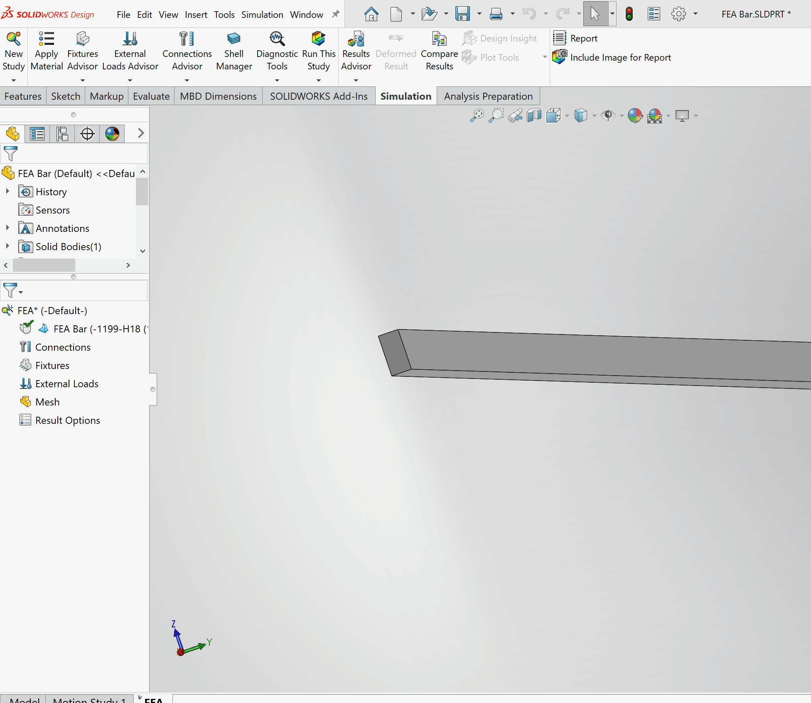
#### Adding the Axial Force
Next I added my chosen load to the opposite cross sectional area. I made sure it was facing the right direction, that it was in lbf units and that I typed in 500 lbf. I later realized I should have typed in my force variable, so I went back and change it to that.
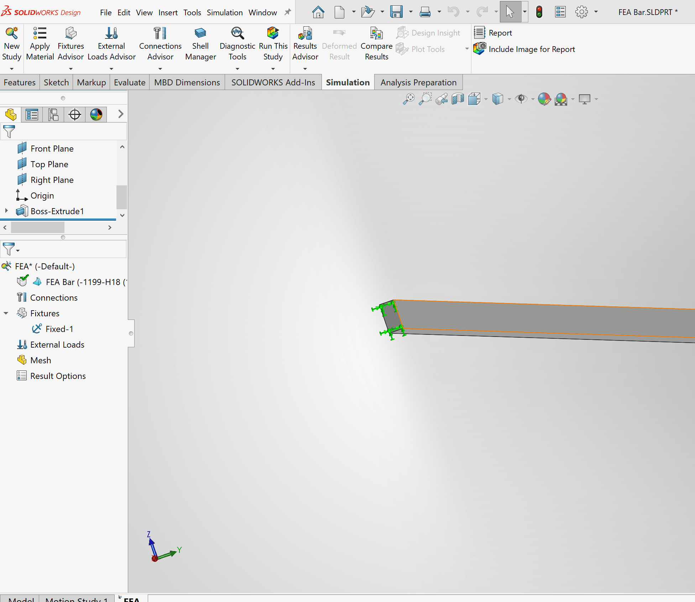
#### Creating the Mesh
In SolidWorks, a mesh is necessary to run simulations. Without even having to look this up, the reason is that it breaks down the model into smaller pieces so that calculations will not take an enormous amount of time or use up all the computer's resources. This is required for highly advanced models and assemblies which would take an extreme amount of time and resources to complete. For this simple model, I decided to bump up the mesh quality to the highest the slider can go, but it is possible to force it to be even higher. This should give very high quality results
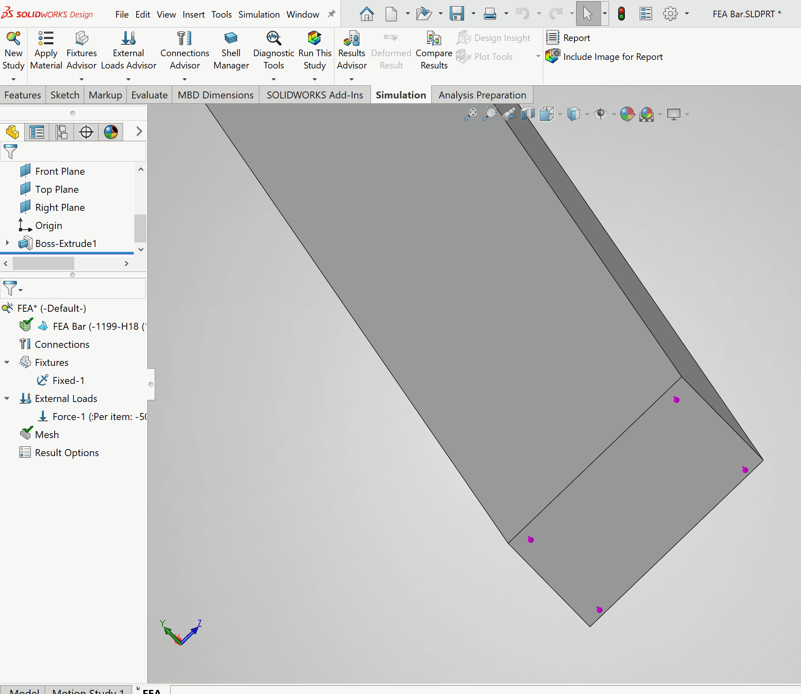
#### Running the Simulation
With everything setup, it is time to run the simulation. This is done by hitting the Run This Study button at the top. In the gif below I speed up the process, but once it finishes, it creates a folder with all the important data
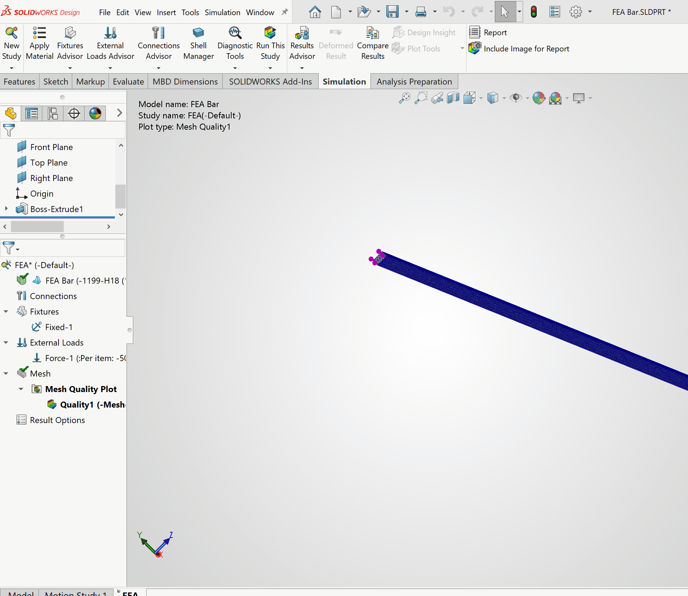

### Sorting and Collecting the Data
#### Von Mises Data
##### Fixing Units
Sadly, the default settings for data are in SI units, so first I decided to change the data display into imperial units and in regular notation. Then I also chose to make the max stress show where it is located. To do so, you simply have to right click the stress data, hit chart options and follow the gif below. 
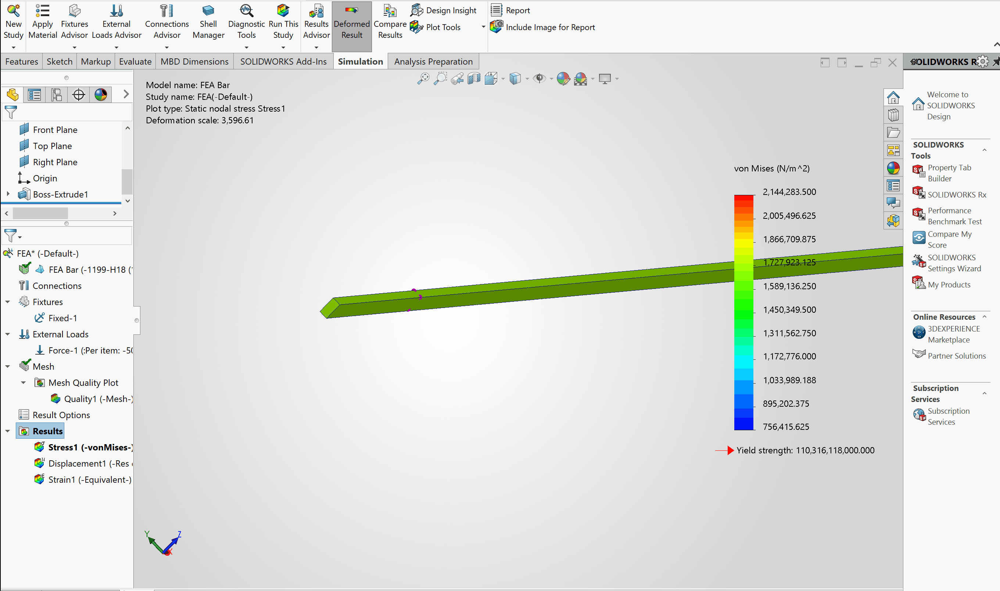
##### Max Stress
With that settled, I found that the max stress was .311 ksi or more simply just 311 psi. Interestingly, the min and max forces are found at the fixture. 
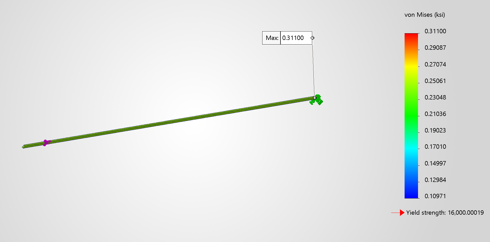
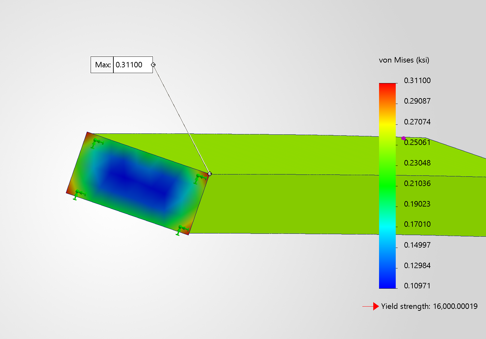
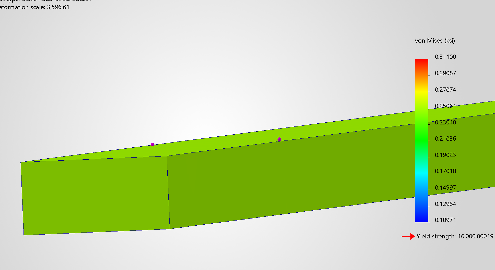

##### Calculating the Factor of Safety
Calculating the factor of safety is incredibly simple. One simply has to divide the yield strength by the FEA calculated max Stress. This is when I realized that the yield strength were we supposed to use was 40 ksi. I calculate using this number and the data I collected and found that the safety factor was a whopping 128.617. Absolutely unnesseray for a fast amount of engineering projects.
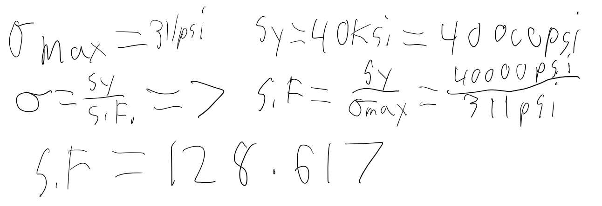

##### Strange Phenomenon
To investigate, I used the ISO tool which allows me to show only sections of the model that are either above or below a selected stress. Interestingly, all stresses above 251 psi and below 249 psi were specifically near the fixture. I wonder what this is. I wish I could investigate but I do not have time. This also shows that the rest of the bar is within that range which is entirely expected based on basic Solid Mechanics
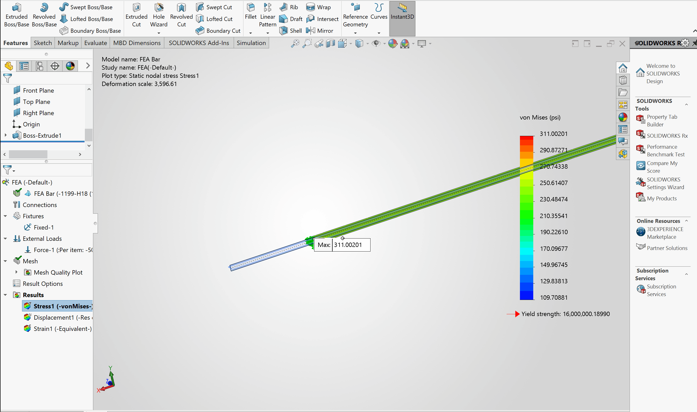

#### Deflection Calculations
Again, the units needs to be fixed. It is done the same way as the last time as seen below 
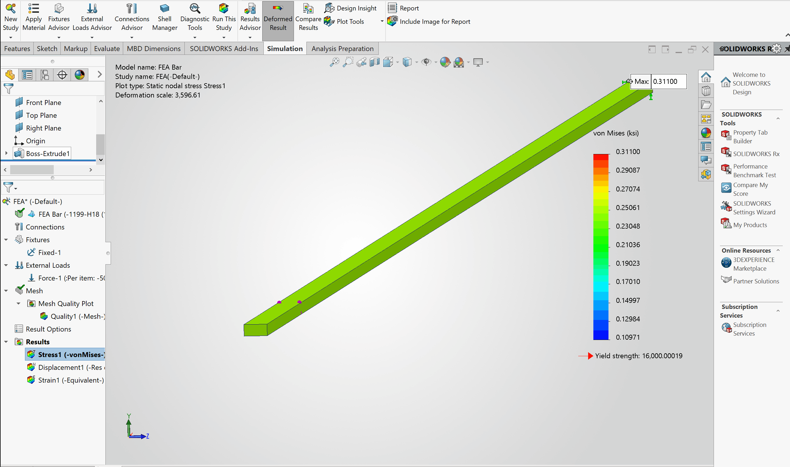

##### FEA Deflection
As the results show, the max deflection (really deflection is actually displacement for this project) is 0.8999 in. I was surprised to the see how the displacement increased as you went down the length of the shaft. Then I remembered this is just because of the set up for this bar. One end is fixed, so it cannot be displaced much. The other faces an axial load, which means that as you go down the shaft to the free end, the displacement accumulates leading to the free side having the max displacement.
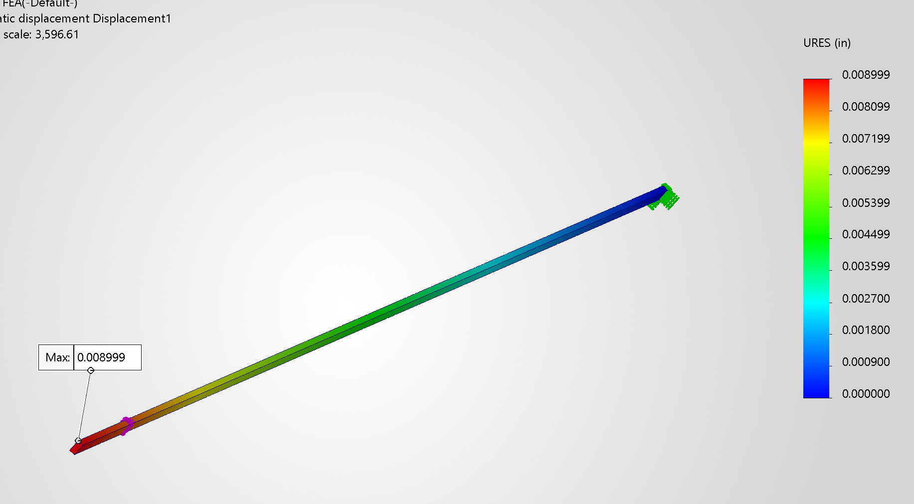

## Comparison of Results
### Percent Difference
Unsurprisingly to me, the results show that the calculate result and the FEA basically came to the same conclusion on the axial deflection. I calculated the percentage differences between and I got a 0.0111117% difference.
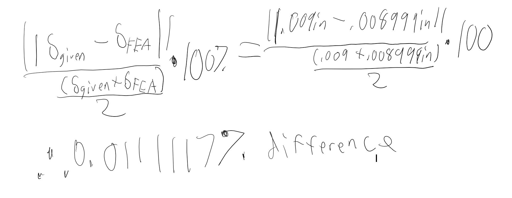

### Why so close? Who is better?
The setup for this problem is one of the most basic problems taught in Solid Mechanics. It uses the most basic conditions that a problem like this can have with single axial loading along the members length, one side being fixed, and no other external factors. On the math side, it is incredibly easy to calculate and does not take any thought to how the stress might be disturbed since the tensile stress application is spread out through the entire cross sectional area. On the computer side of things, SolidWorks Simulation is a pretty high quality simulator that can easily compute this problem. Not only does it get the problem right, it actually is able to take into account far more real life factors to give an even more realistic result that an engineering student wouldn't even think to account for or to even know how to calculate as seen in the strange phenomenon the FEA uncovered. Further more, I didn't even force the simulation to make the mesh even more detailed, so it is possible I can get even better results. In reality, I do think it is a good idea to use both when possible, however, I believe that FEA gives a better and more realistic result overall. Therefore, I think FEA is the better choice. Plus when there are too many variables and factors to take into account, simulations are generally better.

## Adding a Hole
After going through a [pdf I found of chapter 4 of Peters Stress Concentration Factors book](https://onlinelibrary.wiley.com/doi/10.1002/9781119532552.ch4), I found a chart for, what I believe, is my bars stress factor chart with a hole in the side.

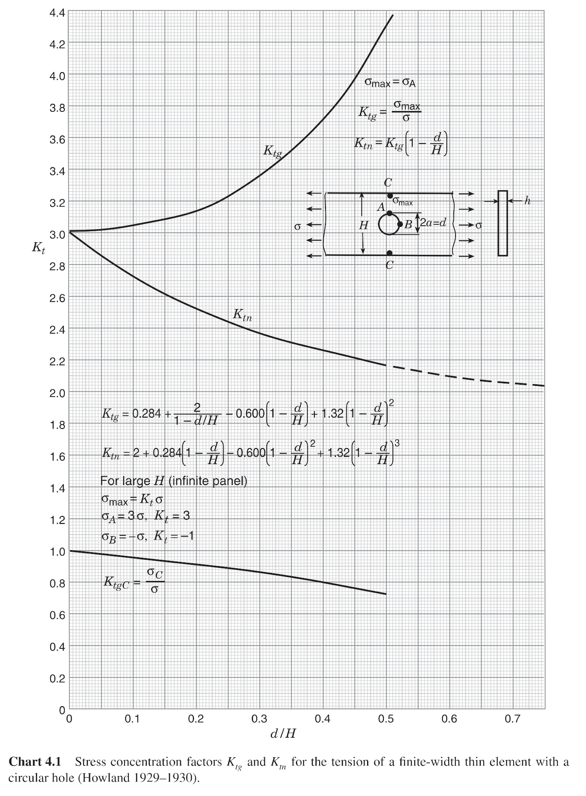

Having no idea what was going on and running low on time, I admittedly asked ChatGPT how to use this strange chart. I simply grabbed the chart and parts of the pdf that talked about it and asked ChatGPT "What do the different stress factors shown represent and what they are used for?" After some discussion, it told me that the "tg" version of the stress factor are in cases where I have the know stresses of the bar without the hole in it. So I decided to use the equations for the "tg" version. Before that, since this is dependent on an axial normal force, I decided to see what the normal stress along the axis was. At this point, I realized that the max stress at the fixture is maybe some sort of error or anomaly. To test it, I used the probe tool to see the stresses through out the bar. It seemed that my assumption was correct since everywhere except the fixture had a x-normal stress  ranging from 249.98 psi to 250.4. This does make sense since the normal stress of F/A the applied force is 500 lbf and the cross sectional area is 2 in^2. Despite this being a possible anomaly, I will keep the calculated safety factor the same because in real life those heavy stresses at the fixture will likely be where the aluminum would yield first. Whereas, the hole is unlikely to be near the hotspots near the fixtur.

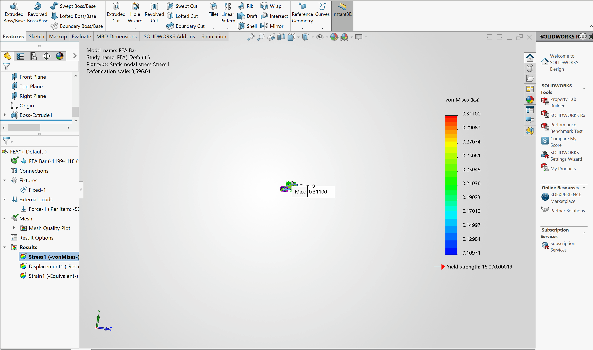

With this in mind, I decided to use the 250 psi as my nominal stress for the calculation needed to find the max stress. Out of curiosity,  I decided to make a near worse case scenario for the side I will put the hole through. The hole will go through the 2 inch side wall, and the hole's diameter will be 1.9 in. As shown below, first I calculated the stress factor, then I calculate the max stress. Unsurprisingly the shear factor was about 40. Considering there would only be a height of .05 in left, this makes complete sense. Then, I found that the max shear stress from this equation would be about 10,000 psi. That is a drastic increase, so how does the factor of safety hold up? Using the equation I used before to calculate the new safety factor of 4. Therefore that means the hole decreases the factor of safety 

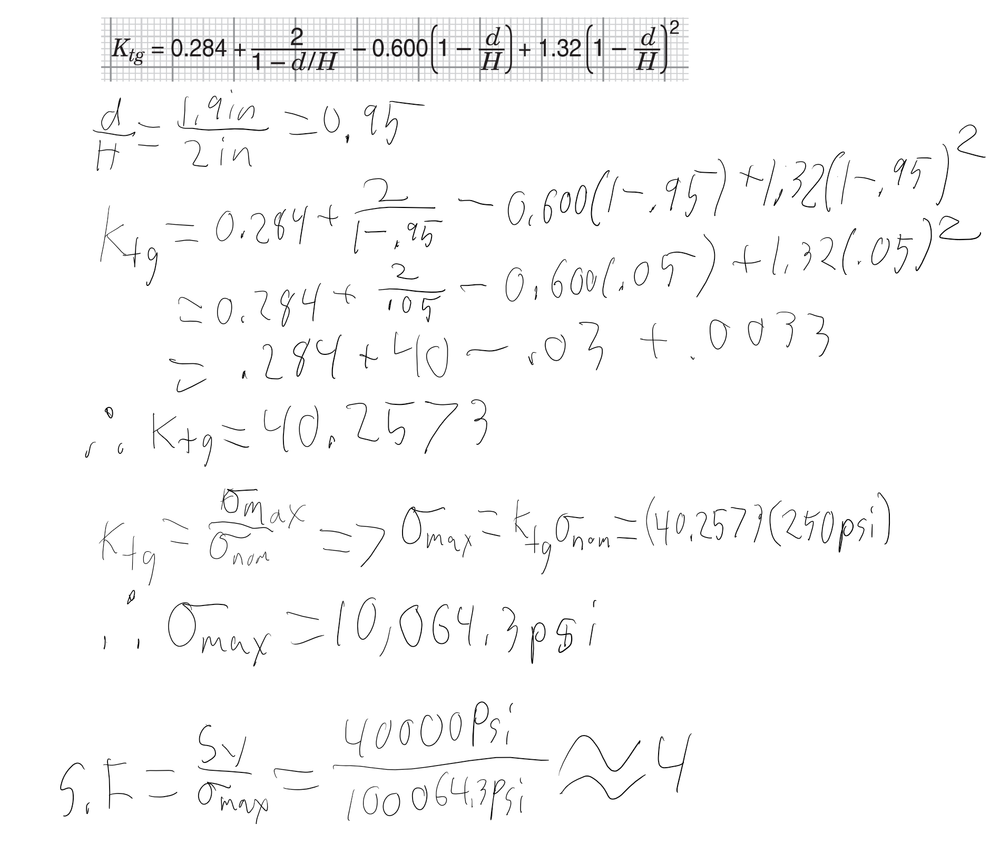

## FEA of a New Bar
### Length increase or decrease?
I will run some numbers through googles random number generator and make my guess from there. 
1. Force = 26658 lbf
2. Width = 32 in 
3. Height = 26 in
The length will definitely increase because of the rearranged equation for length I made at the start. Based on these numbers, 32*26 is probably near a thousand. Treating the force simply as 10000, and the fact the equation has A/F, that means at aa the ratio is 1/10. From before the area was only 2in^2 and the force was 500, which gave a 1/250 ratio. Based on that rough estimate, the length will certainly increase.

### Reality
To see if I was right, I went to SolidWork, inputed the new numbers and let it rebuild the new shape. With resultant of 2525.21 inches. Meaning that was correct on my assumption
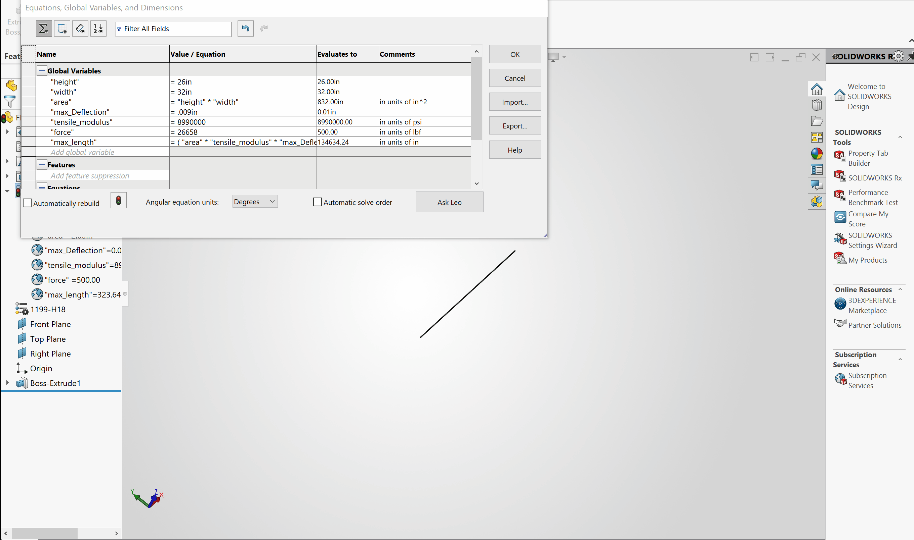

### Von Mises Stress Map
#### Data
With that finished, I restarted the simulation and setup the fixture and force. Then I ran the simulation and I found that the max Stress for this new bar is a near to nothing with 41.186 psi. This makes sense using the same logic as my guess about the length. Stress is F/A, and since the ratio comparison from before was 1/10 vs 1/250, the the flipped result will still show how the new bar is lesser in these circumstances. 

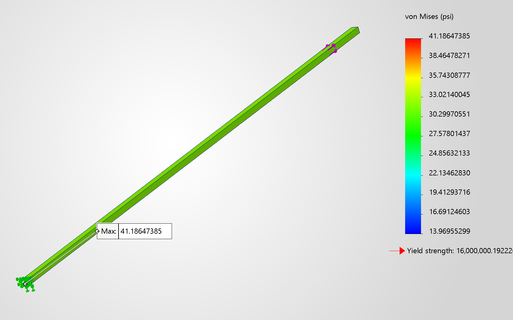

#### Factor of safety
Using the same equation from before, I calculated the factor of Safety as 971. So it is far away from yielding.
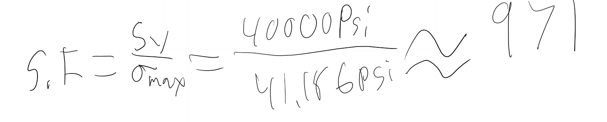

### Deflection
Lastly is deflection, I set up the data graph with the correct. I found that the max displacement is .008996 in. Again, the software gets nearly the same answer that was calculated. 

## Lessons Learned
### What I learned
I learned how parametric design can be used to connect dimensions and equations in SolidWorks to determine the required geometry of a bar. I also learned how to set up and interpret an FEA simulation, including stress, displacement, and factor of safety results. Finally, I learned that analytical calculations and FEA can produce very similar results for simple loading conditions, while FEA can also account for more complex factors that are difficult to calculate manually.

### Time
It took me 10 hours to finish this project due to research and going too far a bit. So the only real mistake I made is trying too hard.

## Parts Files
[You can download the parts files by clicking here.](https://drive.google.com/file/d/1_ckbXdhOMa8RIYmPk1_Jp9HrhMVxH5HJ/view?usp=sharing)

### Resources
1. https://tkcopperandbrass.com/2022/04/07/a-guide-to-the-aluminum-alloy-numbering-system/
2. https://www.matweb.com/search/datasheet.aspx?MatGUID=7a321b89269943629bb6d7a0a4a357b2
3. https://www.academia.edu/39950576/Aluminium_Design_Manual_
4. https://dl.asminternational.org/handbooks/edited-volume/91/chapter/2090685/1xxx-Aluminum-Alloy-Datasheets
5. ChatGPT.com - to understand alloy naming conventions and a strange stress factor graph

Professor Ozgur Keles
SolidWorks
